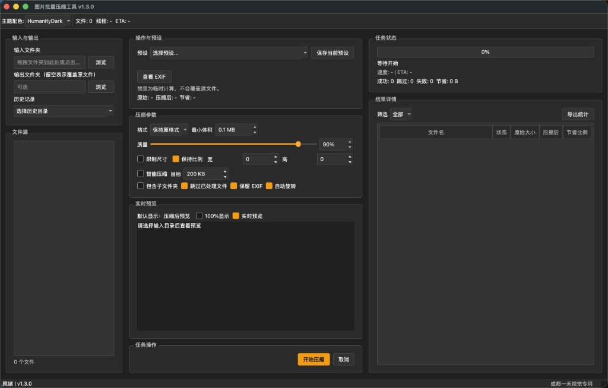

# 图片批量压缩工具 v1.3.1

一个基于 PyQt5 的图形化图片批量压缩工具，支持多线程并行处理、智能压缩、格式转换、预设配置、EXIF 处理等高级功能。


## ⬇️ 快速下载

- [前往 Releases 下载最新版本](https://github.com/9364953w-dotcom/image-compressor/releases/latest)
- [macOS 版（ZIP）](https://github.com/9364953w-dotcom/image-compressor/releases/latest/download/ImageCompressor-macOS.zip)
- [Windows 版（ZIP）](https://github.com/9364953w-dotcom/image-compressor/releases/latest/download/ImageCompressor-Windows.zip)

## 🖼️ 程序界面截图



## ✨ 功能特性

### 基础功能
- 📁 **文件夹拖拽选择** - 支持拖拽文件夹到输入框
- 🖼️ **多格式支持** - JPG、PNG、WebP、BMP、TIFF
- 🔄 **覆盖模式** - 可选择输出文件夹或直接覆盖原文件
- 📂 **子文件夹递归** - 支持包含子文件夹处理
- ⚡ **多线程并行** - 智能线程数控制

### 高级功能（v1.1.0）

#### 1. 尺寸调整
- 限制最大宽度/高度
- 保持原始比例或强制调整
- 适合批量生成缩略图或统一尺寸

#### 2. 格式转换
- 保持原格式
- 统一转换为 JPG、PNG 或 WebP
- 自动处理颜色模式转换

#### 3. 智能压缩
- 自动寻找最佳质量参数
- 指定目标文件大小（如 200KB）
- 二分查找算法快速收敛

#### 4. 历史记录
- 自动保存输入/输出路径
- 下拉框快速选择历史记录
- 保存压缩设置偏好

#### 5. 批量重命名
- 保持原文件名
- 原文件名_序号（如 image_001.jpg）
- 纯序号（如 001.jpg）
- 自定义前缀_序号
- 日期_序号（如 20240301_001.jpg）

#### 6. 详细统计
- 实时表格展示每个文件的处理结果
- 显示原始大小、压缩后大小、节省比例
- 显示尺寸变化信息
- 导出 CSV 统计报告

#### 7. 智能线程控制
- 根据文件大小动态调整线程数
- 大文件（>10MB）：减少线程，避免内存溢出
- 小文件（<100KB）：增加线程，提高吞吐量

#### 8. 增量压缩
- 跳过已用相同设置处理过的文件
- 基于文件哈希和修改时间判断
- 缓存存储在用户目录，跨会话有效

### 新增功能（v1.2.0）

#### 9. 预设配置管理 🎯
内置4种专业预设，一键应用常用配置：

| 预设 | 质量 | 尺寸 | 用途 |
|------|------|------|------|
| 网页用 | 80% | 1920px | 网站展示，平衡质量和大小 |
| 手机分享 | 75% | 1080px | 微信/微博分享，目标200KB |
| 高质量存档 | 95% | 原尺寸 | 长期保存，高质量 |
| 缩略图 | 60% | 300px | 快速预览，小尺寸 |

- 支持保存自定义预设
- 支持删除/管理自定义预设
- 预设下拉框快速选择

#### 10. 压缩预览 👁️
- 选中文件后实时预览压缩效果
- 显示原大小、压缩后大小、节省比例
- 实时预览，不实际保存文件
- 方便调整参数达到最佳效果

#### 11. EXIF 信息处理 📋
- 保留/移除 EXIF 信息选项
- 自动旋转（根据 EXIF 方向自动旋转图片）
- EXIF 信息查看对话框
  - 相机型号、拍摄日期
  - 原始尺寸、GPS 信息
  - 完整 EXIF 数据查看

#### 12. 关于对话框 ℹ️
- 软件信息、版本号
- 开发者信息（MWang, 9364953@qq.com）
- GitHub 仓库链接
- 技术栈信息
- 致谢列表

### 新增功能（v1.3.0）

#### 13. UI 重构（OpenShot 风格） 🎨
- 三栏工作区布局（左侧文件源 / 中侧参数与预览 / 右侧任务统计）
- 深色主题统一（主界面、EXIF、关于窗口风格一致）
- 状态栏新增专用标识展示

#### 14. 预览联动升级 👀
- 文件源选中即预览，默认显示压缩后效果
- 修改压缩参数后自动同步刷新预览与节省数据
- 支持 100% 显示用于清晰度细节对比

## 📁 项目结构

```
image-compressor/
├── src/
│   ├── __init__.py
│   ├── __main__.py          # 程序入口 (Fusion 风格 + 深色主题)
│   ├── config.py            # 配置常量 + ConfigManager (历史记录/缓存/预设)
│   ├── utils.py             # 工具函数
│   ├── core/
│   │   ├── __init__.py
│   │   ├── compressor.py    # 图片压缩核心 (尺寸调整/格式转换/智能压缩/EXIF)
│   │   └── worker.py        # 多线程工作器 (智能线程控制/详细统计)
│   ├── widgets/
│   │   ├── __init__.py
│   │   ├── drag_drop.py     # 拖拽输入框
│   │   ├── about_dialog.py  # 关于对话框 (软件信息/作者/版权)
│   │   ├── exif_dialog.py   # EXIF 查看对话框
│   │   └── main_window.py   # 主窗口 (所有 UI 组件和逻辑)
│   └── resources/
│       └── icon.icns        # 应用图标
├── 图片压缩工具.spec        # PyInstaller 打包配置
├── README.md                # 项目说明文档
├── requirements.txt         # 依赖列表
├── AGENTS.md                # 项目背景文档
└── .gitignore
```

## 🚀 安装使用

### 安装依赖

```bash
pip install PyQt5 Pillow
```

### 开发运行

```bash
cd image-compressor
python -m src
```

### 打包为可执行文件

```bash
pip install pyinstaller
pyinstaller 图片压缩工具.spec
```

## 📖 使用说明

### 基本使用

1. **选择输入文件夹**：点击"浏览..."按钮或拖拽文件夹到输入框
2. **选择输出文件夹**（可选）：
   - 选择输出文件夹：压缩后的图片保存到该文件夹
   - 留空：直接覆盖原文件（会弹出确认提示）
3. **选择预设**（可选）：快速应用常用配置
4. **实时预览**（可选）：在文件源中点选图片，自动显示压缩预览
5. **开始压缩**：点击"开始压缩"按钮

### 预设配置使用

#### 使用内置预设
1. 在"预设配置"区域选择预设（如"网页用"）
2. 所有参数会自动调整到预设值
3. 点击"开始压缩"

#### 保存自定义预设
1. 调整好各项参数
2. 点击"保存当前为预设"
3. 输入预设名称和描述
4. 下次可直接从下拉框选择

### 压缩预览

1. 选择输入文件夹
2. 在文件源列表选择任意图片
3. 调整压缩参数，预览会自动实时刷新
4. 勾选“100%显示”查看细节清晰度
5. 满意后点击“开始压缩”

### EXIF 处理

#### 查看 EXIF 信息
1. 选择输入文件夹
2. 点击"查看 EXIF"
3. 在对话框中查看相机、日期、尺寸等信息

#### 保留/移除 EXIF
- 勾选"保留 EXIF 信息"：压缩后保留原始 EXIF 数据
- 取消勾选：压缩后移除所有 EXIF 数据（保护隐私）

#### 自动旋转
- 勾选"自动旋转"：根据 EXIF 方向信息自动旋转图片
- 解决手机照片方向不对的问题

### 其他高级功能

#### 尺寸调整
1. 勾选"调整尺寸"
2. 设置最大宽度/高度（像素）
3. 勾选"保持比例"以避免图片变形

#### 格式转换
1. 在"输出格式"下拉框选择目标格式
2. 可选择：保持原格式、转换为 JPG/PNG/WebP

#### 智能压缩
1. 勾选"智能压缩"
2. 设置目标大小（如 200KB）
3. 程序会自动尝试不同质量参数，找到最接近目标大小的设置

#### 批量重命名
1. 勾选"重命名文件"
2. 选择命名模式
3. 对于"自定义前缀"模式，输入自定义前缀文本

#### 增量压缩
1. 勾选"跳过已处理文件"
2. 程序会自动跳过用相同设置处理过的文件
3. 缓存文件存储在用户目录 `~/.image-compressor/`

#### 导出统计
1. 压缩完成后，点击"导出统计"按钮
2. 选择保存位置（CSV 格式）
3. 可用 Excel 打开查看详细统计

## 💡 使用技巧

### 场景1：网站图片优化
- **预设**：选择"网页用"
- **调整**：如需更小可再降低质量到 75%
- **预览**：确认效果后开始批量压缩

### 场景2：社交分享图片
- **预设**：选择"手机分享"
- **特点**：自动限制 1080px，目标 200KB
- **效果**：适合微信/微博分享，文件小且清晰度足够

### 场景3：批量归档整理
- **预设**：选择"高质量存档"
- **重命名**：日期_序号
- **EXIF**：保留完整 EXIF 信息

### 场景4：隐私保护分享
- **EXIF**：取消勾选"保留 EXIF 信息"
- **尺寸**：适当缩小尺寸
- **效果**：移除地理位置、拍摄设备等敏感信息

## 📊 压缩效果

| 原格式 | 原大小 | 设置 | 压缩后 | 节省 |
|--------|--------|------|--------|------|
| JPG | 5.2MB | 质量80% + 宽度1920 | 380KB | 92.7% |
| PNG | 2.8MB | 转WebP 质量85% | 420KB | 85.0% |
| BMP | 8.5MB | 转JPG 质量90% | 1.2MB | 85.9% |
| HEIC | 3.5MB | 转JPG 质量85% | 680KB | 80.6% |

## 🔧 技术栈

- **Python** 3.8+ - 编程语言
- **PyQt5** 5.15+ - GUI 框架
- **Pillow** 9.0+ - 图像处理
- **Qt Fusion** - 界面风格（跨平台一致）
- **PyInstaller** - 打包工具

## 👤 开发者

- **开发者**: MWang
- **邮箱**: 9364953@qq.com
- **GitHub**: [@9364953w-dotcom](https://github.com/9364953w-dotcom)
- **项目地址**: https://github.com/9364953w-dotcom/image-compressor

## 📜 许可证

MIT License

## 📝 更新日志

### v1.3.0 (2026-03-05)
- ✨ 新增：三栏布局 UI 重构（中右等宽，交互流程更清晰）
- ✨ 新增：选中文件实时预览，参数变化自动同步
- ✨ 新增：100% 预览模式，便于清晰度对比
- 🎨 优化：EXIF 与关于窗口风格统一为主程序深色主题
- 🔧 优化：状态栏右侧显示“成都一禾视觉专用”

### v1.2.0 (2024-03-01)
- ✨ 新增：预设配置管理（内置4种预设 + 自定义预设）
- ✨ 新增：压缩预览功能
- ✨ 新增：EXIF 信息处理（保留/移除、自动旋转、查看详情）
- ✨ 新增：关于对话框（软件信息、作者、GitHub链接）
- 🎨 优化：采用 Qt Fusion 风格 + 自定义深色调色板
- 📝 新增：AGENTS.md 项目背景文档

### v1.1.0 (2024-03-01)
- 新增：尺寸调整功能
- 新增：格式转换功能
- 新增：智能压缩功能
- 新增：历史记录功能
- 新增：批量重命名功能
- 新增：详细统计表格
- 新增：智能线程控制
- 新增：增量压缩功能

### v1.0.0 (2024-02-28)
- 初始版本发布
- 基础压缩功能
- 多线程支持
- 覆盖/输出模式

## 🙏 致谢

感谢以下开源项目：
- [Qt](https://www.qt.io/) - 跨平台 GUI 框架
- [Pillow](https://python-pillow.org/) - Python 图像处理库
- [PyQt5](https://www.riverbankcomputing.com/) - Python 的 Qt 绑定
